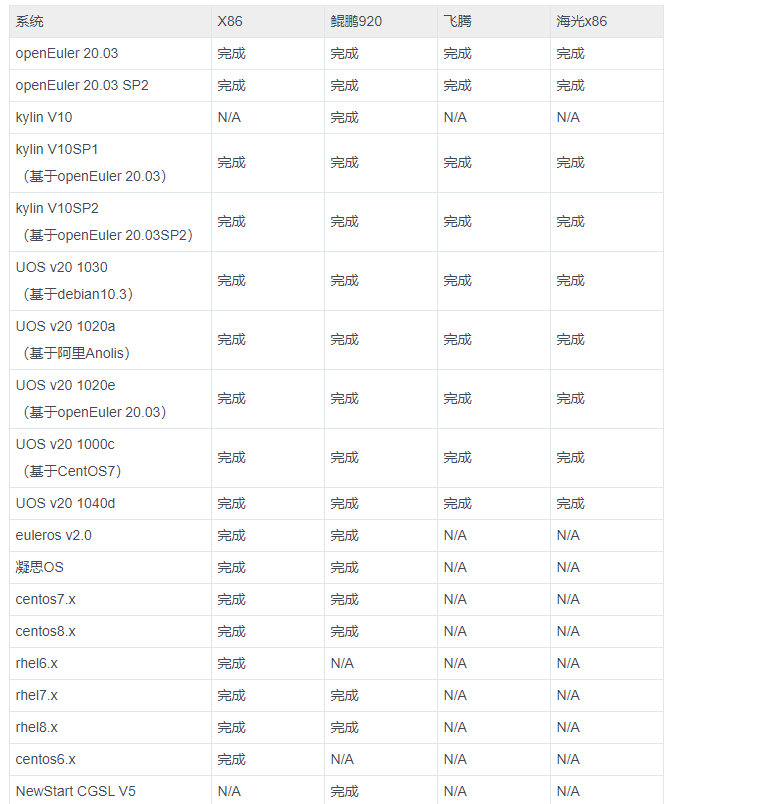
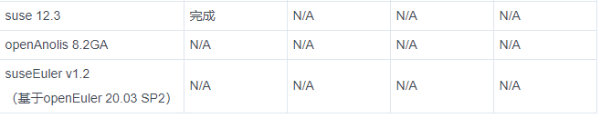
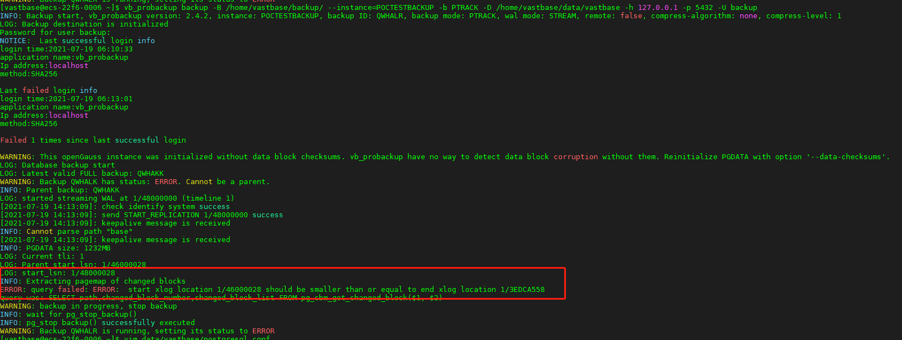
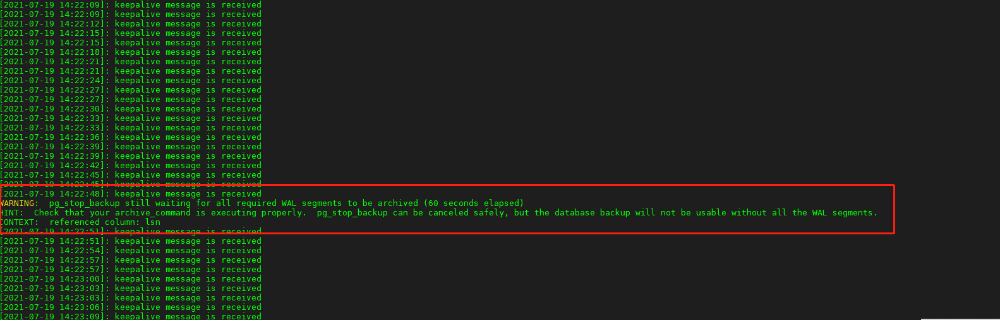
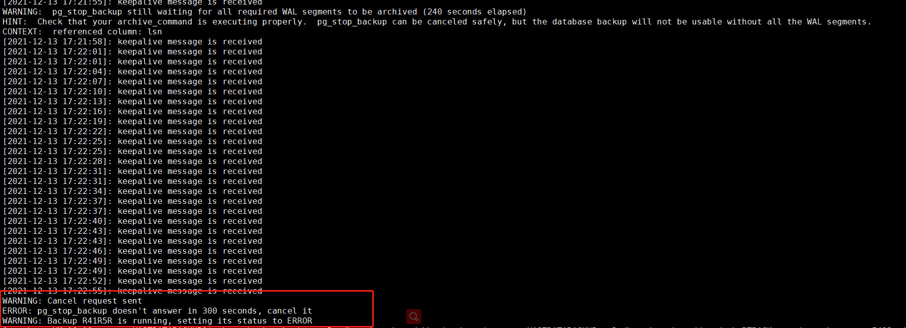
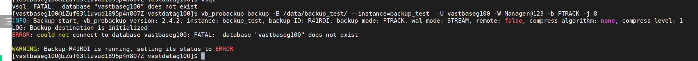
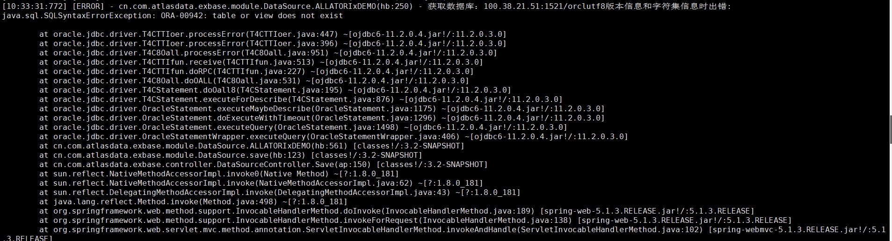
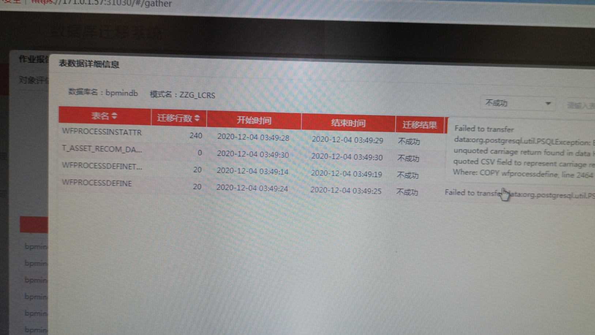

# 前言
## 1 介绍
### 1.1 版本介绍
处于正式发布状态的产品版本号格式为：
A.B (Build x) 或A.B (Build C.x)
各产品根据实际情况选择上述任意一种版本号格式。
每位版本号含义如下：

*   A.B(Build x)
*   A为主版本号，取值范围为1-99。一般当架构或核心功能模块调整、大范围代码重构时，这一位版本号变化。
*   B为次版本号，取值范围为1-99。一般根据产品的迭代而变化。
x为补丁版本号，从0依次递增。一般当发布版本需修复缺陷时，这一位版本号变化。
*   A.B(Build C.x)
*   A为主版本号，取值范围为1-99。一般当架构调整或代码整体重构时，这一位版本号变化。
*   B为次版本号，取值范围为1-99。一般当核心功能模块调整或重构时，这一位版本号变化。
*   C为次次版本号，取值范围为1-99。一般根据产品的迭代而变化。
*   x为补丁版本号，从0依次递增。一般当发布版本需修复缺陷时，这一位版本号变化。

### 1.2 版本适配情况



说明：
完成 已经建立好CI流程，可以出包，如果有需要，请找张莹上传相应安装包
进行中 已经在适配中，一般在2周内可以出安装包
计划中 已经进入适配队列，后期会适配
N/A 没有需求，暂不适配

对于非完成状态或网盘上没有的安装包，请在以下路径填写需求，以作跟踪:
https://doc.weixin.qq.com/txdoc/excel?scode=AHUAfwdSAA8fGuV1mYAPwABgYIAL8&docid=e2_APwABgYIAL8AZgpOpR3Tq2fJFhuEw&type=1
## 2 SQL语言
### 2.1 SQL语法
#### 2.1.1 ALTER
*   批量修改表属主
```
select 'ALTER TABLE ' || table_name || ' OWNER TO grp_nd;' from information_schema.tables where table_schema='grp_nd';
```
* 批量修改序列
```
select 'ALTER sequences ' || sequence_name || ' OWNER TO lis;' from information_schema.sequences where sequence_schema='lis';
```
*   开启表全列日志
```
alter table xxx replica identity full;
```

#### 2.1.2 GRANT
*   把库下面的所有权限给用户
```
grant all PRIVILEGES on database databasename to user;
```
*  将schema下的所有表的权限赋予给另外一个用户
```
grant SELECT,INSERT,UPDATE,DELETE,TRUNCATE,REFERENCES,TRIGGER on all tables in schema 模式名 to dsg;    
#新增表也赋予权限
ALTER DEFAULT PRIVILEGES FOR USER user_name  IN SCHEMA schema_name GRANT CREATE,SELECT ,INSERT,UPDATE,DELETE,TRUNCATE,REFERENCES,TRIGGER ON TABLES TO user_name;
```
#### 2.1.3 SELECT
*   查看某用户的系统权限
```
SELECT * FROM  pg_roles WHERE rolname='postgres';
```
*   查看某用户的表权限
```
select * from information_schema.table_privileges where grantee='postgres';
```
*   查看某用户的usage权限
```
select * from information_schema.usage_privileges where grantee='postgres';
```
*   查看某用户在存储过程函数的执行权限
```
select * from information_schema.routine_privileges where grantee='postgres';
```
*   查看某用户在某表的列上的权限
```
select * from information_schema.column_privileges where grantee='postgres';
```
*   查看当前用户能够访问的数据类型
```
select * from information_schema.data_type_privileges ;
```
*   查看用户自定义类型上授予的USAGE权限
```
select * from information_schema.udt_privileges where grantee='postgres';
```

## 3 服务器设置

### 3.1 Vastbase SYSTEM configure
#### 3.1.1 core configure
```
cat /proc/sys/kernel/core_pattern
echo "/data/core_pattern/core-%e-%p-%t" > /proc/sys/kernel/core_pattern
```
#### 3.1.2 关闭RemoveIPC
操作步骤
1.修改/etc/systemd/logind.conf文件中的“RemoveIPC“值为“no“。

*   使用VIM打开logind.conf文件。
```
vim  /etc/systemd/logind.conf
```
*   修改“RemoveIPC“的值“no“。
```
RemoveIPC=no
```
2.修改/usr/lib/systemd/system/systemd-logind.service文件中的“RemoveIPC“值为“no“。

*   使用VIM打开systemd-logind.service文件。
```
vim /usr/lib/systemd/system/systemd-logind.service
修改“RemoveIPC“的值“no“。
RemoveIPC=no
```
3.重新加载配置参数。
```
systemctl daemon-reload
systemctl restart systemd-logind
```

4.检查修改是否生效。
```
loginctl show-session | grep RemoveIPC
systemctl show systemd-logind | grep RemoveIPC
```

### 3.2 备份和恢复配置
#### 3.2.1 pg_dump 
*   备份数据库结构和数据
```
vb_dump  -Fc -U username  -p port  database -f database_data.dump     
```
*   只备份数据
```
pg_dump -Fc -a -U username  -p port  database -f database_data.dump    
```

#### 3.2.1 vb_probackup
* 前提条件
配置文件
```
enable_cbm_tracking = on
hot_standby = on
full_page_writes = on
archive_mode = on
wal_level = hot_standby
archive_command='/bin/true'
```
ssh
主备互信 主备都操作
```
[vastbase@vastbase-server02 ~]$ ssh-keygen 
```

* 创建备份目录
```
[root@vastbase-server03 data]# mkdir /data/vbbackup
[root@vastbase-server03 data]# chown vastbase225.vastbase225 /data/vbbackup
```
*   初始化备份目录
```
[vastbase@vastbase-server03 ~]$ vb_probackup init -B /data/vbbackup
INFO: Backup catalog '/data/vbbackup' successfully inited
```

*   添加数据库实例
```
[vastbase@vastbase-server03 ~]$ vb_probackup add-instance -B /data/vbbackup -D /data/vastbase225 --instance=VASTDATABACKUP  --remote-host=10.195.25.13  --remote-port=22  --remote-proto=ssh  --remote-path=/home/vastbase225/local/vastbase/bin   --remote-user=vastbase225 
INFO: Instance 'VASTDATABACKUP' successfully inited
```
*   全量备份
```
vb_probackup backup -B /data/vbbackup --instance=VASTDATABACKUP -b f -D /data/vastbase225 -h 10.195.25.13  -p 15432 -U backup  -W LV%LzaFJbk --remote-host=10.195.25.13 --remote-port=22  --remote-proto=ssh --remote-path=/home/vastbase225/local/vastbase/bin --remote-user=vastbase225 
```

*   增量备份
```
vb_probackup backup -B /data/vbbackup --instance=VASTDATABACKUP -b PTRACK -D /data/vastbase -h 10.195.25.14  -p 15432 -U vastuser -W  Vbase@admin --remote-host=10.195.25.14 --remote-port=22  --remote-proto=ssh --remote-path=/home/vastbase/local/vastbase/bin --remote-user=vastbase  
```
*   增量备份日志情况动作
```
2021-12-13 16:02:06.245,"node1","vastbase","vastbase",139750537688832,"[local]",61b6fd9e.1087,26,"",2021-12-13 16:00:30 CST,4/67,0,0,"BACKEND",LOG,00000,"statement: select name, setting from pg_settings where name in ('connection_info')",,,,,,,,,"vb_probackup"
2021-12-13 16:02:06.247,"node1","vastbase","vastbase",139750631929600,"[local]",61b6fd9e.1085,43,"",2021-12-13 16:00:30 CST,7/68,0,0,"BACKEND",LOG,00000,"statement: SET connection_info = '{""driver_name"":""libpq"",""driver_version"":""(Vastbase G100 V2.2 (Build 5.8.3547)) compiled at 2021-10-14 15:46:14 commit 0 last mr  ""}'",,,,,,,,,"vb_probackup"
2021-12-13 16:02:06.249,"node1","vastbase","vastbase",139750566004480,"[local]",61b6fd9e.1091,26,"",2021-12-13 16:00:30 CST,8/69,0,4222124650659947,"BACKEND",LOG,00000,"execute <unnamed>: SELECT pg_catalog.current_setting($1)","parameters: $1 = 'block_size'",,,,,,,,"vb_probackup"
2021-12-13 16:02:06.249,"node1","vastbase","vastbase",139750494697216,"[local]",61b6fd9e.1088,30,"",2021-12-13 16:00:30 CST,10/70,0,4222124650659948,"BACKEND",LOG,00000,"execute <unnamed>: SELECT pg_catalog.current_setting($1)","parameters: $1 = 'wal_block_size'",,,,,,,,"vb_probackup"
2021-12-13 16:02:06.249,"node1","vastbase","vastbase",139750471563008,"[local]",61b6fd9e.1080,26,"",2021-12-13 16:00:30 CST,14/71,0,0,"BACKEND",LOG,00000,"statement: SELECT proname FROM pg_proc WHERE proname='pgpro_edition'",,,,,,,,,"vb_probackup"
2021-12-13 16:02:06.251,"node1","vastbase","vastbase",139750594639616,"[local]",61b6fd9e.1092,45,"",2021-12-13 16:00:30 CST,1/72,0,0,"BACKEND",LOG,00000,"statement: SELECT pg_catalog.pg_is_in_recovery()",,,,,,,,,"vb_probackup"
2021-12-13 16:02:06.252,"node1","vastbase","vastbase",139750615148288,"[local]",61b6fd9e.1093,27,"",2021-12-13 16:00:30 CST,2/73,0,4222124650659951,"BACKEND",LOG,00000,"execute <unnamed>: SELECT pg_catalog.pg_start_backup($1, $2)","parameters: $1 = '2021-12-13 16:02:06+08 with pg_probackup', $2 = 't'",,,,,,,,"vb_probackup"
2021-12-13 16:02:06.465,"node1","vastbase","vastbase",139750520907520,"[local]",61b6fd9e.1089,33,"",2021-12-13 16:00:30 CST,3/74,0,0,"BACKEND",LOG,00000,"statement: show checkpoint_timeout",,,,,,,,,"vb_probackup"
2021-12-13 16:02:06.468,"node1","vastbase","",139749657184000,"[local]",61b6fdfe.1073,6,"",2021-12-13 16:02:06 CST,23/0,0,0,"BACKEND",LOG,00000,"walsender thread started",,,,,,,,,"vb_probackup"
2021-12-13 16:02:06.469,"node1","vastbase","",139749657184000,"[local]",61b6fdfe.1073,7,"",2021-12-13 16:02:06 CST,23/0,0,0,"BACKEND",LOG,00000,"received wal replication command: IDENTIFY_SYSTEM",,,,,,,,,"vb_probackup"
2021-12-13 16:02:06.481,"node1","vastbase","",139749657184000,"[local]",61b6fdfe.1073,8,"",2021-12-13 16:02:06 CST,23/0,0,0,"BACKEND",LOG,00000,"received wal replication command: START_REPLICATION 0/9D000000",,,,,,,,,"vb_probackup"
2021-12-13 16:02:06.495,"node1","vastbase","",139749657184000,"[local]",61b6fdfe.1073,9,"",2021-12-13 16:02:06 CST,23/0,0,0,"BACKEND",LOG,00000,"The primary and standby reached syncstat in WalSndLoop.",,,,,,,,,"vb_probackup"
2021-12-13 16:02:06.504,"node1","vastbase","vastbase",139750537688832,"[local]",61b6fd9e.1087,27,"",2021-12-13 16:00:30 CST,4/75,0,0,"BACKEND",LOG,00000,"statement: SELECT oid, datname FROM pg_catalog.pg_database WHERE datname NOT IN ('template1', 'template0')",,,,,,,,,"vb_probackup"
2021-12-13 16:02:06.505,"node1","vastbase","vastbase",139750631929600,"[local]",61b6fd9e.1085,44,"",2021-12-13 16:00:30 CST,7/76,0,0,"BACKEND",LOG,00000,"statement: SELECT pg_cbm_tracked_location()",,,,,,,,,"vb_probackup"
2021-12-13 16:02:06.507,"node1","vastbase","vastbase",139750566004480,"[local]",61b6fd9e.1091,27,"",2021-12-13 16:00:30 CST,8/77,0,4222124650659955,"BACKEND",LOG,00000,"execute <unnamed>: SELECT path,changed_block_number,changed_block_list FROM pg_cbm_get_changed_block($1, $2)","parameters: $1 = '0/93000028', $2 = '00000000/9D000028'",,,,,,,,"vb_probackup"
2021-12-13 16:02:10.640,"node1","vastbase","vastbase",139750494697216,"[local]",61b6fd9e.1088,31,"",2021-12-13 16:00:30 CST,10/78,0,0,"BACKEND",LOG,00000,"statement: SET client_min_messages = warning;",,,,,,,,,"vb_probackup"
2021-12-13 16:02:10.640,"node1","vastbase","vastbase",139750471563008,"[local]",61b6fd9e.1080,27,"",2021-12-13 16:00:30 CST,14/79,0,0,"BACKEND",LOG,00000,"statement: SET datestyle = 'ISO, DMY';",,,,,,,,,"vb_probackup"
2021-12-13 16:02:10.644,"node1","vastbase","vastbase",139750594639616,"[local]",61b6fd9e.1092,46,"",2021-12-13 16:00:30 CST,1/80,0,4222124650659958,"BACKEND",LOG,00000,"execute <unnamed>: SELECT pg_catalog.pg_create_restore_point($1)","parameters: $1 = 'pg_probackup, backup_id R41NNI'",,,,,,,,"vb_probackup"
2021-12-13 16:02:10.644,"node1","vastbase","vastbase",139750594639616,"[local]",61b6fd9e.1092,47,"",2021-12-13 16:00:30 CST,1/80,0,4222124650659958,"BACKEND",LOG,00000,"restore point ""pg_probackup, backup_id R41NNI"" created at 0/9D0001B0",,,,,"referenced column: pg_create_restore_point",,,,"vb_probackup"
2021-12-13 16:02:10.697,"node1","vastbase","vastbase",139750615148288,"[local]",61b6fd9e.1093,28,"",2021-12-13 16:00:30 CST,2/81,0,0,"BACKEND",LOG,00000,"statement: SELECT pg_catalog.txid_snapshot_xmax(pg_catalog.txid_current_snapshot()), current_timestamp(0)::timestamptz, pg_catalog.pg_stop_backup() as lsn",,,,,,,,,"vb_probackup"
2021-12-13 16:02:17.533,"node1","vastbase","",139749657184000,"[local]",61b6fdfe.1073,10,"",2021-12-13 16:02:06 CST,23/0,0,0,"BACKEND",LOG,00000,"walsender thread shut down",,,,,,,,,"vb_probackup"
2021-12-13 16:02:17.533,"node1","vastbase","",139749657184000,"[local]",61b6fdfe.1073,11,"",2021-12-13 16:02:06 CST,,0,0,"BACKEND",LOG,00000,"disconnection: session time: 0:00:11.066 user=vastbase database= host=[local]",,,,,,,,,"vb_probackup"
2021-12-13 16:02:19.924,"node1","vastbase","vastbase",139750520907520,"[local]",61b6fd9e.1089,34,"",2021-12-13 16:00:30 CST,3/0,0,0,"BACKEND",LOG,00000,"disconnection: session time: 0:00:13.678 user=vastbase database=vastbase host=[local]",,,,,,,,,"vb_probackup"
```
*   查看备份
```
vb_probackup show -B /data/vbbackup
```
*   归档备份设置  
``` 
vi postgresql.conf
archive_command='/home/vastbase/local/bin/vb_probackup   archive-push   -B  /home/vastbase/vbbackup/ --instance=VASTDATABACKUP --wal-file-path=%p   --wal-file-name=%f'
```
*   查看归档详细
```
vb_probackup show -B  /data/vbbackup --instance=VASTDATABACKUP --archive
```

*   删除备份
```
vb_probackup delete -B  /data/vbbackup --instance=VASTDATABACKUP -i QWA0QZ
```

*   备份有效性检测
```
vb_probackup validate  -B  /data/vbbackup --instance=VASTDATABACKUP
```
*   备份保留策略
```
vb_probackup set-config  -B  /data/vbbackup --instance=VASTDATABACKUP --retention-window=3
```

*   查看备份配置
```
vb_probackup show-config  -B  /data/vbbackup --instance=VASTDATABACKUP
```
* 备份wal日志
```
vb_probackup archive-push -B /data/vbbackup --instance=VASTDATABACKUP --wal-file-name=wal-file-name
```
* 删除过期数据
```
vb_probackup delete -B /data/vbbackup  --instance=VASTDATABACKUP --delete-expired
```
*   同时删除过期WAL
```
vb_probackup delete -B /data/vbbackup  --instance=VASTDATABACKUP --delete-expired --delete-wal
```

##### 3.2.1.1 常见报错
*   1.增量备份时报错：
```
RROR: query failed: ERROR:  invalid input syntax for transaction log location: ""
query was: SELECT path,changed_block_number,changed_block_list FROM pg_cbm_get_changed_block($1, $2)
```

*   解决方法
添加配置文件：
```
enable_cbm_tracking = on
```

*   2.全备时报错连接数据库报错
```
[vastbase@VM-16-10-centos ~]$ vb_probackup backup  -B  /home/vastbase/vbbackup/  --instance=VASTDATABACKUP  -D /home/vastbase/data/ -b f  -d vastbase 
INFO: Backup start, vb_probackup version: 2.4.2, instance: VASTDATABACKUP, backup ID: R41MSH, backup mode: FULL, wal mode: STREAM, remote: false, compress-algorithm: none, compress-level: 1
LOG: Backup destination is initialized
WARNING: This Vastbase instance was initialized without data block checksums. vb_probackup have no way to detect data block corruption without them. Reinitialize PGDATA with option '--data-checksums'.
LOG: Database backup start
ERROR: could not connect to database vastbase: ERROR:  replication should connect HA port in thread_pool

WARNING: backup in progress, stop backup
INFO: wait for pg_stop_backup()
INFO: pg_stop backup() successfully executed
WARNING: Backup R41MSH is running, setting its status to ERROR
```
* 解决方法
检查配置连接 是否需要添加端口
```
[vastbase@VM-16-10-centos ~]$ vb_probackup backup  -B  /home/vastbase/vbbackup/  --instance=VASTDATABACKUP  -D /home/vastbase/data/ -b f  -d vastbase  -p 5432
INFO: Backup start, vb_probackup version: 2.4.2, instance: VASTDATABACKUP, backup ID: R41MTF, backup mode: FULL, wal mode: STREAM, remote: false, compress-algorithm: none, compress-level: 1
LOG: Backup destination is initialized
WARNING: This Vastbase instance was initialized without data block checksums. vb_probackup have no way to detect data block corruption without them. Reinitialize PGDATA with option '--data-checksums'.
LOG: Database backup start
INFO:  Try to bind walsender thread to available CPUs in threadpool.
LOG: started streaming WAL at 0/93000000 (timeline 1)
INFO:                                                                                                     Cannot parse path "base"
[2021-12-13 15:44:03]: check identify system success
[2021-12-13 15:44:03]: send START_REPLICATION 0/93000000 success                                    
[2021-12-13 15:44:03]: keepalive message is received                                                
[2021-12-13 15:44:03]: keepalive message is received                                                
INFO: PGDATA size: 1002MB
INFO: Start transferring data files
LOG: Creating page header map "/home/vastbase/vbbackup/backups/VASTDATABACKUP/R41MTF/page_header_map"
[2021-12-13 15:44:06]: keepalive message is received                                                
[2021-12-13 15:44:09]: keepalive message is received                                                
[2021-12-13 15:44:09]: keepalive message is received                                                
[2021-12-13 15:44:12]: keepalive message is received                                                
INFO: Data files are transferred, time elapsed: 10s
 INFO: wait for pg_stop_backup()
INFO: pg_stop backup() successfully executed
LOG: stop_lsn: 0/930001E0
LOG: Looking for LSN 0/930001E0 in segment: 000000010000000000000093
LOG: Found WAL segment: /home/vastbase/vbbackup/backups/VASTDATABACKUP/R41MTF/database/pg_xlog/000000010000000000000093
LOG: Thread [0]: Opening WAL segment "/home/vastbase/vbbackup/backups/VASTDATABACKUP/R41MTF/database/pg_xlog/000000010000000000000093"
LOG: Found LSN: 0/930001E0
[2021-12-13 15:44:18]:(null): not renaming 000000010000000000000094, segment is not complete.
LOG: finished streaming WAL at 0/94000140 (timeline 1)
LOG: Getting the Recovery Time from WAL
LOG: Thread [0]: Opening WAL segment "/home/vastbase/vbbackup/backups/VASTDATABACKUP/R41MTF/database/pg_xlog/000000010000000000000093"
INFO: Syncing backup files to disk
INFO: Backup files are synced, time elapsed: 1s
INFO: Validating backup R41MTF
 INFO: Backup R41MTF data files are valid
INFO: Backup R41MTF resident size: 1034MB
INFO: Backup R41MTF completed
```
*   3. 增量备份时一直keepalive message is received
```
[2021-12-13 16:43:45]: keepalive message is received                                                
[2021-12-13 16:43:48]: keepalive message is received                                                
WARNING:  pg_stop_backup still waiting for all required WAL segments to be archived (240 seconds elapsed)
HINT:  Check that your archive_command is executing properly.  pg_stop_backup can be canceled safely, but the database backup will not be usable without all the WAL segments.
```

解决方法：
查看归档是否成功，归档失败会一直keepalive message is received ,超过300S会失败报错

添加归档即可
```
archive_command='/bin/true' 
```
使用vb_probackup归档可这样添加:
切记 配置文件中 --instance=VASTDATABACKUP 不能设置成 --instance  VASTDATABACKUP ，配置文件中instance用空格的方式归档会成功，但是vb_probackup增量备份会失败
```
vi postgresql.conf
archive_command='/home/vastbase/local/bin/vb_probackup   archive-push   -B  /home/vastbase/vbbackup/ --instance=VASTDATABACKUP --wal-file-path=%p   --wal-file-name=%f'
```

*   4. vb_probackup 备份不用vastbase OS用户报错
报错截图：

错误原因：
vb_probackup 默认连接的是vastbase库，如果OS用户是其他的会差不多库，需要添加 -d 参数
```
 vb_probackup backup  -B  /home/vastbase/vbbackup/  --instance=VASTDATABACKUP  -D /home/vastbase/data/ -b PTRACK    -d vastbase  -p 5432
```


### 3.3 迁移工具Exbase
#### 3.3.1 Exbase3.5目标库atlasdb开启了SSL导致增量迁移失败
1.incremental日志报错
```
RPC请求参数:{jobid=O_2_A_210#incremental, tasktype=apply, thread=Y, jobtype=incremental, jobname=O_2_A_210, taskid=O_2_A_210#incremental#apply#1},应答参数:{msg=task:O_2_A_210#incremental#apply#1,执行任务发生错误:{"otherMsg":"目标库错误","eMsg":"SSL error: java.security.NoSuchAlgorithmException: SunTls12MasterSecret KeyGenerator not available","logId":"202103096af0"},errorCode:ERR00001, result=error, autoRestart=false, code=40002, errorcode=ERR00001, status=error}
```
*   解决办法：
  1. 关闭目标库的SSL
  2.修改exbase配置
 ```
 /deployment/atlasdb/bin/psql -p31003 atlasdb exbase
 atlasdb=> update etc.tb_jdbcinfo set defaultproperties='reWriteBatchedInserts=true;defaultRowFetchSize=200;ssl=false;sslmode=disable;' where dbtype='atlasdb';
 systemctl restart incremental
 ```

#### 3.3.2 权限问题
查询 v$instance, v$nls_parameters 报错

*   解决方法
按照定义数据库赋予权限

#### 3.3.3 修改关键字字段单独迁移操作
在配置库执行：
```
insert into exbase.tb_systemcolumn_mapping values('vastbase','原字段名','修改的字段名');
```
如本来转换成authid的，改成authid1了，则
```
insert into exbase.tb_systemcolumn_mapping values('vastbase','link','"link"');
```
执行完成后，重启exbase
重新迁移


#### 3.3.4 修改exbase导入方式
1.使用exbase copy方式导入失败可以修改导入数据方式

*   修改exbase导入数据方式  0 ： insert   1： copy
```
update exbase.tb_parameter set migratemgr=migratemgr::jsonb||'{"isusecopy":"0"}';
```
这样子配置是换成insert写入数据，可以设置完单独装载这张表
装完之后再改加copy写入数据，执行下面的语句
```
update exbase.tb_parameter set migratemgr=migratemgr::jsonb||'{"isusecopy":"1"}';
```

* 配置库修改并行度
```
update exbase.tb_parameter set migratemgr=migratemgr::jsonb||'{"createindexparallel": 4}'
```

## 4 客户端接口
### 4.1 JDBC_FDW

## 5 错误代码
### 5.1 error code configure
* 设置错误代码返回给客户端 
```
postgres=# \set VERBOSITY verbose
vastbase=# select * from t;
ERROR:  
GAUSS-05140: relation "t" does not exist on node1
SQLSTATE: 42P01
LINE 1: select * from t;                      ^
vastbase=# 
```
* 服务端日志输出错误代码
```
set log_error_verbosity ='verbose';  
2021-12-08 23:08:57 CST [139729386796800]: user=vastbase,db=vastbase,app=vsql,client=[local]  0 [BACKEND] LOG:  00000: statement: select * from t;
2021-12-08 23:08:57 CST [139729386796800]: user=vastbase,db=vastbase,app=vsql,client=[local]  0 [BACKEND] LOCATION:  exec_simple_query, postgres.cpp:2212
2021-12-08 23:08:57 CST [139729386796800]: user=vastbase,db=vastbase,app=vsql,client=[local]  3096224743829662 [BACKEND] ERROR:  42P01: relation "t" does not exist on node1 at character 15
```
* 参数定义
```
log_error_verbosity
参数说明：控制服务器日志中每条记录的消息写入的详细度。
该参数属于 SUSET 类型参数，请参考表 11-1 中对应设置方法进行设置。
取值范围：枚举类型
* terse 输出不包括 DETAIL、HINT、QUERY 及 CONTEXT 错误信息的记录。
* verbose 输出包括 SQLSTATE 错误代码 、源代码文件名、函数名及产生错误所在的行号。
* default 输出包括 DETAIL、HINT、QUERY 及 CONTEXT 错误信息的记录，不包括 SQLSTATE
错误代码 、源代码文件名、函数名及产生错误所在的行号。
默认值：default
```

### 5.2 


##  6 自动化平台
### 6.1 技术栈
ansible + Python
* 安装操作
```
yum -y install ansible
# 安装完成之后设置ansible项目角色路径
vi /etc/ansible/ansible.cfg 
roles_path    = /root/auto_app/roles
# 设置需要管理的主机
vim /etc/ansible/hosts 
[db-server]
192.160.0.10
```

* 巡检模块
```
pip install docxtpl
```

* ansible 角色概念
1.创建一个role
ansible-galaxy init role—name
创建后的目录结构如下： 
```
role_A
├── defaults
│ └── main.yml
├── files
├── handlers
│ └── main.yml
├── meta
│ └── main.yml
├── README.md
├── tasks
│ └── main.yml
├── templates
├── tests
│ ├── inventory
│ └── test.yml
└── vars
└── main.yml
```
2.目录结构
*   tasks : 用于存放role_A的主要任务，也可以添加其他task文件，供main.yaml调用，从而实现更加复杂的部署功能。
*   handlers : 用于存放触发执行（ hanlders ）的任务。
*   defaults : 用于存放默认变量，优先级最低，变量优先级可参考《ansible基础-变量》。
*   vars : 用于存放变量文件，role_A中任务和模版里用到的变量可以在这里定义。
*   files ：用于存放需要拷贝到目的主机的文件，例如，作为「copy」模块src参数的默认根目录。
*   template : 用于存放模版文件，格式为.j2，文件内容要符合Jinja2语法规则，通常使「template」模块部署服务的配置文件。
*   meta : 用于存放role依赖列表，这个知识点后面会详细阐述。
*   tests : 用于存放测试role本身功能的playbook和主机定义文件，在开发测试阶段比较常用。

### 6.2 常用命令
ansible-playbook
*   --check  只检测不真正执行 -C
*   --list-host  列出运行任务的主机
*   --limit  只针对某个主机
*   -v  显示过程  -vv -vvv 更详细

*   检查语法
```
ansible-playbook --syntax-check site.yml
```

*   输出执行结果
```
- name: Print debug infomation eg
hosts: "{{host}}"
gather_facts: F
tasks:
- name: Command run line
shell: hostname
register: result
- name: Show debug info
debug: var=result.stdout verbosity=0
```

* 单独执行某个tag
```
ansible-playbook --tags=t2 testtag.yml
```
